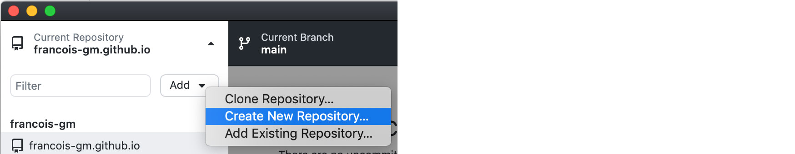
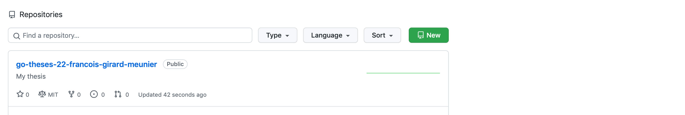
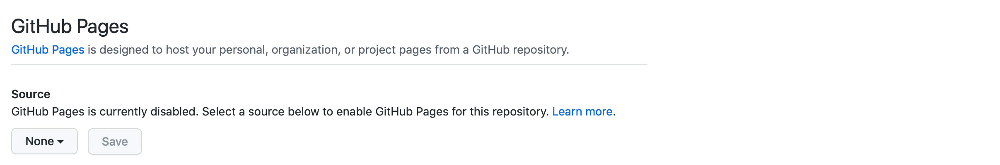

# Github pages

## Ways of connecting / using...

- Terminal: either Git ([documentation](https://git-scm.com/download/mac)),or the Github CLI ([documentation](https://github.com/cli/cli)) *
- Desktop app: Github Desktop**, ([Download here](https://desktop.github.com))

\* CLI = Command User Interface, ** GUI = Graphic User Interface

## Deploy your first page

- [Download here](https://desktop.github.com), and follow the installation steps...
- ... Then follow the official documentation instructions here: https://pages.github.com

### Folder name structure

In your Githup Desktop App (top left corner of the app):
- `Add -> Create new repository`
- 
- Naming convention: `go-theses-[year]-[firstname]-[lastname]` (example: go-theses-25-francois-girard-meunier)... 'thes**e**s' with a 'e' (plural of thesis), the year only with the **last two digits**, and your first name + last name in **lowercase**.
- You can also use: https://slugify.online to figure out how to format your name following the right naming convention.
- Path: *where you will be working on your thesis from your computer desktop drive.*
- Other options: *as you wish (you can always add these files later if you want).*
- After you have created your repository, publish it on the KABK Github (top left again)
- 
- Then, choose: `Github.com`
- Name: *same as before (follows the name convention)*
- Make sure 'keep this code private' is **not checked**! Otherwise your website won't be available online (!)
- Organization = `kabk`

**Tadah!**

- 

- Now, you can do the following actions in order to 'update' your website 'fetch', 'commit', 'push' and 'pull'.
- This will be your URL: https://kabk.github.io/go-theses-25-francois-girard-meunier
- But it throws an error 404! Oops.
- Just add an `index.html` file to your folder, make a 'commit', and 'push' that commit: this will update the github folder with your changes.
- Then, on the Github website: https://github.com/kabk/
- Go to your repository folder, click over it. Once inside it, go to -> `settings`. Then -> `Pages`. For `source`, choose `main`, and **save**.
- 
- 

Now it should be public and online at the said url :)

